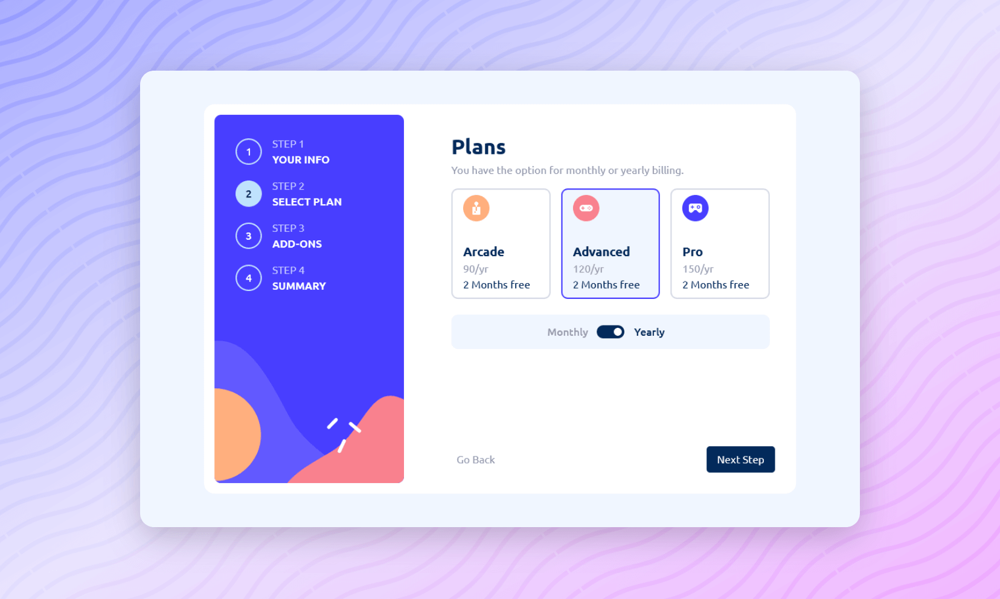

<div align="center">

  

  <h2>Multi Step Form</h2>

  <h3>
    <a href="https://multi-step-form-codepapa.vercel.app">
      <strong>Demo Website</strong>
    </a>
  </h3>

  <div align="center">
    <a href="https://www.frontendmentor.io/solutions/multi-step-form-w-react-and-redux-toolkit-XaJTbJ92Xn">Solution (FEM)</a>
    •
    <a href="https://github.com/CodePapa360/Multi-Step-Form/issues">Report Bug</a>
    •
    <a href="https://github.com/CodePapa360/Multi-Step-Form/pulls">Request Feature</a>
  </div>

  <hr>

</div>

<!-- Badges -->
<div align="center">

<!-- Status -->


<!-- Liceensee -->


<a href='https://www.twitter.com/CodePapa360' target="_blank"></a>
<a href='https://www.linkedin.com/in/codepapa360' target="_blank"></a>

</div>

<!-- Brief -->
<p align="center">
This React project demonstrates a multi-step form. The form utilizes React Hook Form for data validation and Redux Toolkit for state management, enhancing user experience and data integrity.
</p>

<!-- Screenshot -->
<a align="center" href="https://multi-step-form-codepapa.vercel.app">



</a>

## Table of contents📚

- [Key Features](#key-features)
- [My process](#my-process)
  - [Built with](#built-with)
  - [What I learned](#what-i-learned)
- [Installation](#installation)
- [Author](#author)
- [Acknowledgments](#acknowledgments)
- [License](#license)

## Key Features🎉

Users should be able to:

- Complete each step of the sequence
- Go back to a previous step to update their selections
- See a summary of their selections on the final step and confirm their order
- Receive form validation messages if:
  - A field has been missed
  - The email address is not formatted correctly
  - A step is submitted, but no selection has been made
- See hover and focus states for all interactive elements on the page
- View the optimal layout for the interface depending on their device's screen size

## My process🛠️

### Tech Stack🏗️

- React
- React Hook Form
- Styled Components
- Vite

### What I Learned💡

- **Breaking down complex forms into manageable steps:** I learned that multi-step forms can significantly improve user engagement and reduce form abandonment by breaking down complex data collection processes into smaller, more manageable steps.

- **Implementing data validation with React Hook Form:** I gained experience in utilizing React Hook Form to effectively validate user inputs, ensuring data integrity and preventing invalid submissions.

- **Leveraging Redux Toolkit for state management:** I explored the power of Redux Toolkit for managing the form's state, facilitating consistent data handling and easy updates.

## Installation📥

- Clone this repo:

```sh
git clone https://github.com/CodePapa360/Multi-Step-Form.git
```

- Install dependencies:

```sh
npm install
```

- Build command:

```sh
npm run build
```

- Live server:

```sh
npm run dev
```

## Author👤

<b>Alamin</b>

- Twitter - [@CodePapa360](https://www.twitter.com/CodePapa360)
- LinkedIn - [@CodePapa360](https://www.linkedin.com/in/codepapa360)
- Frontend Mentor - [@CodePapa360](https://www.frontendmentor.io/profile/CodePapa360)
- Github: [@CodePapa360](https://github.com/codepapa360)

Feel free to contact me with any questions or feedback!

## Star this project🌟

Show your appreciation by starring this project on GitHub.🙂 Your support will motivate me to continue creating and sharing valuable open-source projects

## Acknowledgments🙏

I would like to express my gratitude to Frontend Mentor for providing the challenge and inspiration to build this project. Their platform and resources have been instrumental in my learning journey and the development of this project.

## License📜

This project is licensed under the [MIT](./LICENSE.md) License - see the LICENSE file for details.
